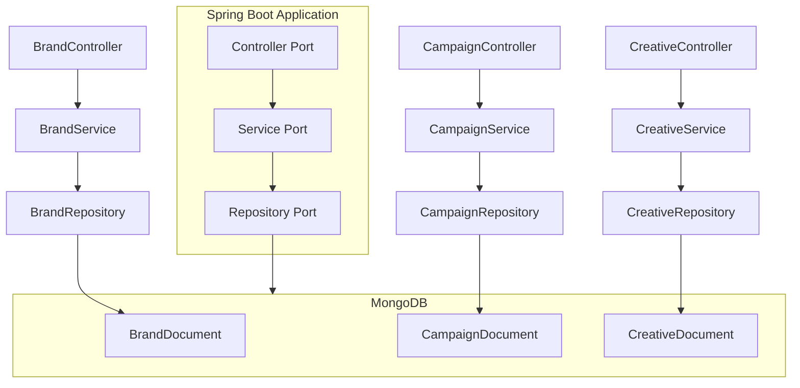

# Project Architecture and Execution Guide

## Overview of the Solution

This project aims to provide a comprehensive system for managing brands, campaigns, and creatives within a digital
advertising platform. Leveraging the power of Spring Boot and MongoDB, it offers a robust backend infrastructure capable
of handling a variety of advertising operations efficiently. Designed with scalability and maintenance in mind, this
solution is well-suited for both small startups and large enterprises looking to optimize their advertising workflows.

## Architecture Overview

The system's architecture is designed following the Hexagonal Architecture approach, also known as Ports and Adapters.
This design pattern aims to create a loosely coupled application that isolates the core logic from external concerns. By
structuring the application into several key layers, each responsible for a distinct aspect of the application's
functionality, we ensure flexibility and ease of maintenance:

- **Controller Layer (Adapters)**: Acts as the primary entry point for HTTP requests, exposing RESTful APIs for
  interacting with the application. This layer adapts requests from the external world into a format that the
  application can use.
- **Service Layer (Application Core)**: Implements the business logic and use case execution. It serves as the
  application's core, where the main functionalities and rules are processed.
- **Repository Layer (Adapters)**: Manages CRUD operations with the MongoDB database, acting as an adapter that allows
  the application core to interact with the database without being coupled to it.
- **Model Layer**: Defines the structure of the data entities used across the application, central to the application's
  domain.
- **Domain Layer**: Represents the core business logic and entities. It is the heart of the application, where the
  business rules and domain logic reside.
- **Infrastructure Layer (Adapters)**: Configures the technical infrastructure, including database connections and other
  system-wide settings. This layer includes adapters for various external interfaces the application interacts with.

By adhering to the Hexagonal Architecture, we ensure that the application's core logic is independent of external
interfaces and frameworks, making the system more resilient to changes in technology or business requirements.

**Key Components**



**Classes**

```mermaid
classDiagram
    class BrandController {
        +createBrand(brand: Brand): ResponseEntity<Brand>
        +listBrands(page: int, size: int): ResponseEntity<List<Brand>>
        +getBrandById(brandId: String): ResponseEntity<Brand>
        +updateBrand(brandId: String, brand: Brand): ResponseEntity<Brand>
        +deleteBrand(brandId: String): ResponseEntity<?>
        +createCampaignForBrand(brandId: String, campaign: Campaign): ResponseEntity<Campaign>
        +listCampaignsForBrand(brandId: String, page: int, size: int): ResponseEntity<List<Campaign>>
        +listCreativesForCampaign(brandId: String, campaignId: String, page: int, size: int): ResponseEntity<List<Creative>>
        +uploadCreative(brandId: String, campaignId: String, file: MultipartFile, name: String, description: String): ResponseEntity<Creative>
    }
    class CampaignController {
        +createCampaign(campaign: Campaign): ResponseEntity<Campaign>
        +listCampaigns(page: int, size: int): ResponseEntity<List<Campaign>>
        +getCampaignById(campaignId: String): ResponseEntity<Campaign>
        +updateCampaign(campaignId: String, campaign: Campaign): ResponseEntity<Campaign>
        +deleteCampaign(campaignId: String): ResponseEntity<?>
    }
    class CreativeController {
        +createCreative(creative: Creative): ResponseEntity<Creative>
        +listCreatives(page: int, size: int): ResponseEntity<List<Creative>>
        +getCreativeById(creativeId: String): ResponseEntity<Creative>
        +updateCreative(creativeId: String, creative: Creative): ResponseEntity<Creative>
        +deleteCreative(creativeId: String): ResponseEntity<?>
    }

    class ManageCampaignUseCase {
        +createCampaign(String brandId, Campaign campaign)
        +listCampaigns(PageRequest pageRequest)
        +getCampaignById(String campaignId): Optional<Campaign>
        +updateCampaign(String campaignId, Campaign campaign): Optional<Campaign>
        +deleteCampaign(String campaignId): boolean
        +createCampaignForBrand(String brandId, Campaign campaign)
        +findCampaignsByBrandId(String brandId, PageRequest pageRequest)
        +findCreativesByBrandIdAndCampaignId(String brandId, String campaignId, PageRequest pageRequest)
    }
    class ManageCreativeUseCase {
        +listCreatives(PageRequest pageRequest): List<Creative>
        +getCreativeById(String creativeId): Optional<Creative>
        +updateCreative(String creativeId, Creative creative): Optional<Creative>
        +deleteCreative(String creativeId): boolean
    }

    class BrandRepository
    class CampaignRepository
    class CreativeRepository

    class BrandEntity {
        -id: String
        -name: String
        -description: String
    }
    class CampaignEntity {
        -id: String
        -name: String
        -description: String
        -brandId: String
    }
    class CreativeEntity {
        -id: String
        -name: String
        -description: String
        -creativeUrl: String
        -campaignId: String
    }

    class Brand
    class Campaign
    class Creative

    class MongoDBConfig {
        +mongoTemplate(): MongoTemplate
    }
    class BrandRepositoryImpl {
        +save(BrandEntity brand): BrandEntity
        +findById(String id): Optional<BrandEntity>
        +findAll(PageRequest pageRequest): List<BrandEntity>
        +deleteById(String id): void
    }
    class CampaignRepositoryImpl {
        +save(CampaignEntity campaign): CampaignEntity
        +findById(String id): Optional<CampaignEntity>
        +findAll(PageRequest pageRequest): List<CampaignEntity>
        +deleteById(String id): void
    }
    class CreativeRepositoryImpl {
        +save(CreativeEntity creative): Creative
        +findById(String id): Optional<CreativeEntity>
        +findAll(PageRequest pageRequest): List<CreativeEntity>
        +deleteById(String id): void
        +findByCampaignId(String campaignId, PageRequest pageRequest): List<CreativeEntity>
        +findByBrandIdAndCampaignId(String brandId, String campaignId, PageRequest pageRequest): List<CreativeEntity>
    }

    class WebSecurity
    class WebMvcConfig
    class SwaggerConfig

    BrandController --> ManageCampaignUseCase
    CampaignController --> ManageCampaignUseCase
    CreativeController --> ManageCreativeUseCase
    ManageCampaignUseCase --> BrandRepository
    ManageCampaignUseCase --> CampaignRepository
    ManageCreativeUseCase --> CreativeRepository
    BrandRepositoryImpl --> MongoDBConfig
    CampaignRepositoryImpl --> MongoDBConfig
    CreativeRepositoryImpl --> MongoDBConfig
    BrandRepository --> BrandRepositoryImpl
    CampaignRepository --> CampaignRepositoryImpl
    CreativeRepository --> CreativeRepositoryImpl
    MongoDBConfig --> WebSecurity
    MongoDBConfig --> WebMvcConfig
    MongoDBConfig --> SwaggerConfig
```



## Technical Stack

- **Programming Language**: Java 17
- **Framework**: Spring Boot
- **Database**: MongoDB (embedded and real instance on docker)
- **Build Tool**: Maven

## Running the Application

To get the application up and running on your local machine, follow these steps:

1. **Prerequisites**:
    - Java 17 or newer installed.
    - MongoDB running on the default port (27017).
    - Maven installed for building the application.
    - Docker installed (optional, for running MongoDB in a container).
    - Docker Compose installed (optional, for running MongoDB in a container).

2. **Clone the Repository**:
   Clone the project repository to your local machine using the following command:
   ```shell
   git clone git@github.com:angelspitfire/smart-assets-be-challenge.git
   cd smart-assets-be-challenge
    ```
3. **Build the Application**:

```shell
   mvn clean package
   ```

4. **Run the Application**:

```shell
   java -jar target/smart-assets-be-challenge-0.0.1-SNAPSHOT.jar
   ```

or alternatively, you can run the application using the following command:

```shell
   mvn spring-boot:run
   ```

or using docker-compose:

```shell
   docker-compose up
   ```

5. **Access the Application**:
   The application will be accessible at [http://localhost:8080](http://localhost:8080). You can use tools like Postman or cURL to interact
   with the RESTful APIs provided by the application.
   The Swagger UI is also available at [http://localhost:8080/swagger-ui.html](http://localhost:8080/swagger-ui.html), providing a user-friendly interface for
   exploring and testing the APIs.

## Considerations

- **Embedded MongoDB for Local Use**: The application uses an embedded MongoDB instance by default for local
  development. To switch to a standalone MongoDB instance, update the connection details in the `application.yaml` file.

- **MongoDB for docker-compose**: The application automatically runs a MongoDB instance when running with
  docker-compose. This setup is designed to bypass the need for local MongoDB installation, especially useful due to a
  bug on Apple Silicon machines related to de.flapdoodle.embed.mongo.